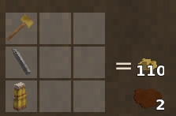

# Recycle Armors

A Vintage Story mod that allows players to recycle metal armors (chain, scale, plate) back into thier base components: metal bits and leather using hammer and chisel.

## Requrements
- Vintage Story 1.22.0 or newer
- Must be installed both on server and client to work on multiplayer


## Features
* **Immersive Recycling:** Place any craftable metal armor into the crafting grid alongside a Chisel and Hammer above it to break it down. *Example recipe:*

     

* **Dynamic Returns:** Recipes dynamically scale the returned items based on a global configuration multiplier which can be adjusted in mod configuration file.

## Configuration
Upon first loading a world or starting the server, a configuration file is generated at `VintagestoryData/ModConfig/recycleArmorsConfig.json`.

```json
{
  "ReturnRate": 0.75
}
```
`ReturnRate` represents precentage of materials returned from the orginal armor cost and can be adjusted to any value between `0.0` and `1.0`. 

For example:
- `1.0` = 100%
- `0.75` = 75%
- `0.5` = 50%

## License
This project is licensed under the [GNU General Public License v3.0 (GPL-3.0)](LICENSE)

*Developed by StardustVulpine @ FoxTale Group*